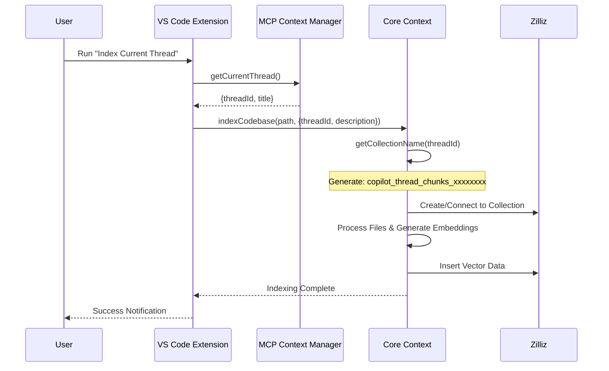
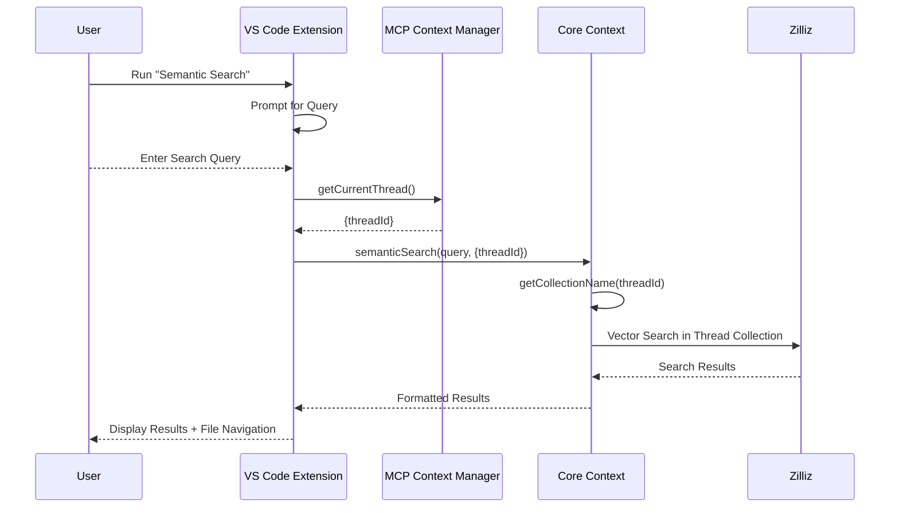

# Claude Memory - Technical Blueprint

## Architecture Overview

Claude Memory enhances the original claude-context system with thread-aware indexing capabilities. The system consists of three main components working together to provide isolated, thread-specific code search and indexing.

```
┌─────────────────┐    ┌─────────────────┐    ┌─────────────────┐
│   VS Code       │    │  MCP Servers    │    │    Zilliz      │
│   Extension     │◄──►│                 │◄──►│   Database     │
│                 │    │                 │    │                 │
│ • Index Command │    │ claude-context  │    │ • Collections   │
│ • Search Command│    │ claude-context- │    │ • Vector Index  │
│ • Thread Context│    │   memory        │    │ • Metadata      │
└─────────────────┘    └─────────────────┘    └─────────────────┘
```

## Component Architecture

### 1. VS Code Extension (`packages/vscode-extension/`)

**Purpose**: User interface and VS Code integration layer

**Key Components**:
- **IndexCommand**: Handles thread-aware indexing requests
- **SearchCommand**: Manages semantic search operations  
- **MCPContextManager**: Manages thread context and MCP communication
- **Extension Activator**: Registers commands and initializes services

**Thread Context Flow**:
```typescript
// Extension retrieves current thread context
const threadContext = await mcpContextManager.getCurrentThread();
const threadId = threadContext?.threadId || 'default';

// Passes thread context to core operations
await context.indexCodebase(workspacePath, {
  threadId: threadId,
  description: `Thread: ${threadContext?.title || 'Default'}`
});
```

### 2. Core Context Library (`packages/core/`)

**Purpose**: Thread-aware indexing and search logic

**Key Methods**:
```typescript
class Context {
  // Thread-specific collection naming
  getCollectionName(threadId?: string): string {
    if (threadId) {
      const hash = crypto.createHash('md5')
        .update(threadId)
        .digest('hex')
        .substring(0, 8);
      return `copilot_thread_chunks_${hash}`;
    }
    return this.collectionName; // fallback
  }

  // Thread-aware indexing
  async indexCodebase(path: string, options?: {
    threadId?: string;
    description?: string;
  }): Promise<void>

  // Thread-specific search  
  async semanticSearch(query: string, options?: {
    threadId?: string;
    limit?: number;
  }): Promise<SearchResult[]>
}
```

### 3. MCP Servers

#### A. claude-context (Original - Code Operations)
**Purpose**: Core code indexing and search functionality
**Tools**: `index_codebase`, `search_code`, `clear_index`, `get_indexing_status`
**Scope**: Handles actual vector operations and file processing

#### B. claude-context-memory (Fork - Conversation Management)  
**Purpose**: Thread and conversation context management
**Tools**: `bootstrap_context`, `list_sessions`, `search_memory`, `store_conversation`
**Scope**: Manages conversation history and thread context

## Data Flow Sequences

### Indexing Flow



### Search Flow



## Collection Naming Strategy

### Thread-Specific Collections

**Format**: `copilot_thread_chunks_xxxxxxxx`
- **Prefix**: `copilot_thread_chunks_` (consistent identifier)
- **Suffix**: 8-character MD5 hash of thread ID
- **Thread ID**: Unique identifier from conversation context

**Hash Generation**:
```typescript
function generateCollectionHash(threadId: string): string {
  return crypto.createHash('md5')
    .update(threadId)
    .digest('hex')
    .substring(0, 8);
}

// Example:
// threadId: "conv_abc123def456"
// hash: "a1b2c3d4" 
// collection: "copilot_thread_chunks_a1b2c3d4"
```

**Collection Metadata**:
```json
{
  "collection_name": "copilot_thread_chunks_a1b2c3d4",
  "description": "Thread: Implementing User Authentication",
  "thread_id": "conv_abc123def456",
  "created_at": "2025-09-17T10:30:00Z"
}
```

## Thread Isolation Mechanism

### Collection Separation
- **Unique Collections**: Each thread gets dedicated Zilliz collection
- **Independent Indexes**: No shared vector space between threads
- **Isolated Search**: Search operations limited to thread collection
- **Metadata Isolation**: Thread-specific descriptions and context

### Context Flow
```typescript
// Thread context propagation through system
ThreadContext {
  threadId: string;     // Unique thread identifier
  title: string;        // Human-readable thread title  
  timestamp: Date;      // Thread creation/update time
}

// Context passing chain:
MCPContextManager → IndexCommand → Core.indexCodebase() → Zilliz Collection
MCPContextManager → SearchCommand → Core.semanticSearch() → Zilliz Query
```

## Database Schema

### Zilliz Collection Structure

**Vector Fields**:
```json
{
  "id": "string",           // Unique chunk identifier
  "vector": "float_vector", // 1536-dimensional embedding
  "text": "varchar",        // Original text content
  "metadata": "json"       // File and chunk metadata
}
```

**Metadata Schema**:
```json
{
  "file_path": "string",     // Relative file path
  "chunk_index": "number",   // Chunk position in file
  "start_line": "number",    // Starting line number
  "end_line": "number",      // Ending line number
  "language": "string",      // Programming language
  "thread_id": "string",     // Associated thread ID
  "indexed_at": "string"     // ISO timestamp
}
```

## Extension Integration Points

### VS Code Command Registration
```typescript
// packages/vscode-extension/src/extension.ts
export function activate(context: vscode.ExtensionContext) {
  // Thread-aware indexing command
  const indexCommand = vscode.commands.registerCommand(
    'claude-context.indexThread',
    IndexCommand.execute
  );

  // Thread-aware search command  
  const searchCommand = vscode.commands.registerCommand(
    'claude-context.semanticSearch',
    SearchCommand.execute
  );

  context.subscriptions.push(indexCommand, searchCommand);
}
```

### MCP Context Manager Integration
```typescript
// Thread context retrieval from MCP
class MCPContextManager {
  async getCurrentThread(): Promise<ThreadContext | null> {
    // Communicates with claude-context-memory MCP server
    // Retrieves active thread information
    // Returns thread context for collection naming
  }

  async getThreadHistory(): Promise<ThreadContext[]> {
    // Retrieves list of available threads
    // Used for thread selection and management
  }
}
```

## Error Handling & Resilience

### Thread Context Fallbacks
```typescript
// Graceful fallback when thread context unavailable
const threadId = threadContext?.threadId || 'default';
const description = threadContext?.title 
  ? `Thread: ${threadContext.title}`
  : 'Default Collection';
```

### Collection Management
- **Existence Checking**: Verify collection exists before operations
- **Creation Retry**: Automatic retry on collection creation failures  
- **Connection Pooling**: Reuse Zilliz connections across operations
- **Timeout Handling**: Graceful handling of network timeouts

### User Experience
- **Progress Indicators**: Real-time progress during indexing
- **Error Messages**: Clear, actionable error notifications
- **Cancellation**: Allow users to cancel long-running operations
- **Status Persistence**: Remember last operation status

## Performance Considerations

### Collection Size Management
- **Thread Isolation**: Smaller collections per thread vs. large shared collection
- **Search Performance**: Faster queries on smaller, focused collections
- **Memory Usage**: Reduced memory footprint per search operation
- **Index Efficiency**: Optimized vector indexes for thread-specific content

### Caching Strategy
- **Collection Metadata**: Cache collection existence and properties
- **Thread Context**: Cache current thread information
- **Search Results**: Optional result caching for repeat queries
- **Connection Pooling**: Reuse database connections

## Security & Privacy

### Data Isolation
- **Thread Boundaries**: Strict separation between thread collections
- **Access Control**: Thread-specific access patterns
- **Metadata Protection**: Thread titles and context isolation
- **Cross-Thread Prevention**: No accidental data leakage

### Authentication
- **Zilliz Tokens**: Secure API token management
- **Environment Variables**: Secure credential storage
- **Connection Security**: TLS/SSL for all database communications

## Scalability Architecture

### Horizontal Scaling
- **Multiple Threads**: Support unlimited concurrent threads
- **Collection Limits**: Respect Zilliz cluster collection limits
- **Resource Management**: Monitor per-collection resource usage
- **Cleanup Strategies**: Archive or cleanup old thread collections

### Performance Monitoring
- **Indexing Metrics**: Track indexing speed and success rates
- **Search Latency**: Monitor query response times
- **Collection Growth**: Track collection size and performance impact
- **Error Rates**: Monitor and alert on failure patterns

## Development Workflow

### Build Process
```bash
# Core library build
cd packages/core && npm run build

# VS Code extension build  
cd packages/vscode-extension && npm run webpack:dev

# MCP server build
cd packages/mcp && npm run build
```

### Testing Strategy
- **Unit Tests**: Core logic and collection naming
- **Integration Tests**: End-to-end indexing and search flows
- **Thread Isolation Tests**: Verify complete separation
- **Performance Tests**: Benchmark indexing and search operations

### Deployment Pipeline
1. **Local Development**: Extension development host
2. **Package Creation**: VSIX packaging for distribution
3. **MCP Server Deployment**: Standalone server deployment  
4. **Production Rollout**: Staged rollout with monitoring